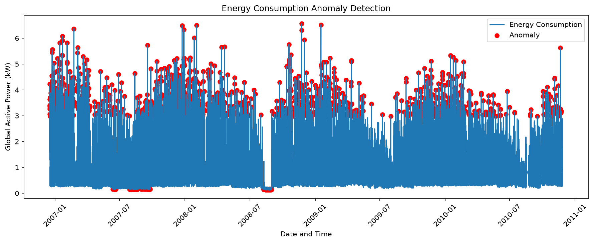

# ⚡ Energy Consumption Anomaly Detection

### with User Question Answering System

An intelligent system that detects abnormal electricity consumption patterns in household data using **Isolation Forest** algorithm, with an interactive **Question Answering chatbot** powered by a modern FastAPI web interface.

[Features](#-features) • [Demo](#-demo) • [Installation](#-installation) • [Usage](#-usage) • [Results](#-results)

---

## 📌 Overview

Household electricity consumption data contains hidden anomalies — sudden spikes, drops, or unusual patterns that indicate:

- 🔌 Faulty appliances
- ⚡ Power surges
- 🏠 Energy theft
- 📉 Meter malfunction

This project **automatically detects these anomalies** using unsupervised machine learning, and provides a **conversational interface** to query energy statistics.

---

## ✨ Features

| Feature | Description |
|---------|-------------|
| 🔍 **Anomaly Detection** | Isolation Forest detects unusual consumption patterns |
| 💬 **Interactive QA** | Ask questions in plain English about the data |
| 📊 **Interactive Charts** | Plotly charts with zoom, hover, and pan |
| ⚙️ **Adjustable Threshold** | Control anomaly sensitivity from the dashboard |
| 📥 **Export Results** | Download detected anomalies as CSV |
| 🎨 **Modern UI** | Beautiful dark theme with smooth animations |
| 📱 **Responsive Design** | Works on desktop, tablet, and mobile |

---

## 🎬 Demo

### Dashboard Preview

### Sample Questions

User: average
Bot: Average consumption: 1.092 kW

User: anomalies
Bot: Detected anomalies: 1,696 (4.96%)

User: show anomalies
Bot: Top 5 anomalies:
• 2007-02-11 22:00 → 2.974 kW
• 2007-03-15 18:00 → 3.214 kW

---

## 📂 Dataset

| Property | Details |
|----------|---------|
| **Name** | Individual Household Electric Power Consumption |
| **Source** | [UCI ML Repository](https://archive.ics.uci.edu/ml/datasets/individual+household+electric+power+consumption) |
| **Location** | Sceaux, France |
| **Period** | December 2006 – November 2010 (47 months) |
| **Records** | ~2,075,259 minute-level measurements |
| **Missing Values** | ~1.25% |

**Key Columns Used:**

- `Date` — Measurement date (dd/mm/yyyy)
- `Time` — Measurement time (hh:mm:ss)
- `Global_active_power` — Household active power (kW)

---

## 🧠 Methodology

### Pipeline

Raw Data → Cleaning → Hourly Resampling → Isolation Forest → Anomalies → Visualization

### Steps

1. **Data Cleaning** — Handle missing values (`?`), convert to numeric
2. **Timestamp Creation** — Combine Date + Time into Datetime index
3. **Resampling** — Aggregate minute-level data to hourly averages
4. **Model Training** — Fit Isolation Forest with contamination parameter
5. **Prediction** — Classify each hour as `Normal` or `Anomaly`
6. **Visualization** — Plot time series with highlighted anomalies

### Algorithm: Isolation Forest

- **Type:** Unsupervised anomaly detection
- **Principle:** Anomalies are "few and different" — easier to isolate
- **Contamination:** 0.05 (5% expected anomalies)
- **Random State:** 42 (reproducibility)

---

## 🚀 Installation

### Prerequisites

- Python 3.14 or higher
- pip package manager

### Steps

**1. Clone the repository**

git clone https://github.com/abhishekmaurya78/Energy_Consumption_Anomaly_Detection.git
cd Energy_Consumption_Anomaly_Detection

**2. Install dependencies**

pip install -r requirements.txt

**3. Run the FastAPI application**

uvicorn app:app --reload

**4. Open in browser**

http://127.0.0.1:8000

---

## 💻 Usage

### Web Dashboard (FastAPI)

uvicorn app:app --reload

Opens at http://127.0.0.1:8000

### CLI Version

python main.py

### Sample Questions

| Question | Answer |
|----------|--------|
| `total` | Total hourly readings |
| `average` | Average consumption (kW) |
| `maximum` | Highest consumption |
| `minimum` | Lowest consumption |
| `anomalies` | Total anomalies detected |
| `status` | Anomaly percentage |
| `show anomalies` | List top anomalies |
| `help` | Show all commands |

---

## 📊 Results

### Summary Statistics

| Metric | Value |
|--------|-------|
| Total hourly readings | 34,168 |
| Normal readings | 32,472 |
| **Anomalies detected** | **1,696 (4.96%)** |
| Average consumption | 1.092 kW |
| Maximum consumption | ~7.5 kW |
| Minimum consumption | ~0.1 kW |

### Key Insights

- 🕐 **Peak hours:** Evening (6 PM – 9 PM)
- 🌙 **Lowest usage:** Early morning (2 AM – 5 AM)
- ⚡ **Top anomalies:** Night-time sudden spikes
- 📅 **Seasonal patterns:** Higher consumption in winter months

---

## 🛠️ Tech Stack

| Technology | Purpose |
|------------|---------|
| **Python 3.14** | Core language |
| **Pandas** | Data manipulation |
| **NumPy** | Numerical operations |
| **Scikit-learn** | Isolation Forest model |
| **FastAPI** | Web backend |
| **Plotly** | Interactive visualizations |
| **HTML/CSS/JS** | Frontend |

---

## 📁 Project Structure

Energy_Consumption_Anomaly_Detection/
│
├── app.py                            # FastAPI backend
├── main.py                           # CLI version
├── household_power_consumption.zip   # Dataset (compressed)
├── results.csv                       # Detected anomalies
├── anomaly_plot.png                  # Output graph
├── requirements.txt                  # Dependencies
├── vercel.json                       # Vercel deployment config
├── README.md                         # Documentation
├── LICENSE                           # MIT License
│
├── templates/
│   └── index.html                    # Web page
│
└── static/
    ├── style.css                     # Styling
    └── script.js                     # Frontend logic

---

## 🔮 Future Scope

- [ ] **Deep Learning** — LSTM / Autoencoder for better detection
- [ ] **Real-time Streaming** — Live data from smart meters
- [ ] **Multi-feature Detection** — Use Voltage, Intensity, Sub-metering
- [ ] **Mobile App** — React Native frontend
- [ ] **Alert System** — Email/SMS when anomaly detected
- [ ] **Multi-household Support** — Analyze multiple homes

---

## 🤝 Contributing

Contributions are welcome! Please follow these steps:

1. Fork the repository
2. Create a feature branch (`git checkout -b feature/AmazingFeature`)
3. Commit changes (`git commit -m 'Add AmazingFeature'`)
4. Push to branch (`git push origin feature/AmazingFeature`)
5. Open a Pull Request

---

## 📜 License

This project is licensed under the **MIT License** — see the [LICENSE](LICENSE) file for details.

---

## 👨‍💻 Author

**Abhishek Maurya**

- 🎓 Babu Banarsi Das University
- 📧 abhishekmaurya53957@gmail.com
- 🐙 [GitHub](https://github.com/abhishekmaurya78/Energy_Consumption_Anomaly_Detection)

---

## 🙏 Acknowledgments

- [UCI Machine Learning Repository](https://archive.ics.uci.edu/ml/index.php) for the dataset
- [Scikit-learn](https://scikit-learn.org/) for Isolation Forest
- [FastAPI](https://fastapi.tiangolo.com/) for the web framework
- [Plotly](https://plotly.com/) for interactive visualizations

---

### ⭐ Star this repo if you found it useful!

Made with ❤️ and ⚡ by Abhishek Maurya

